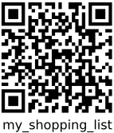
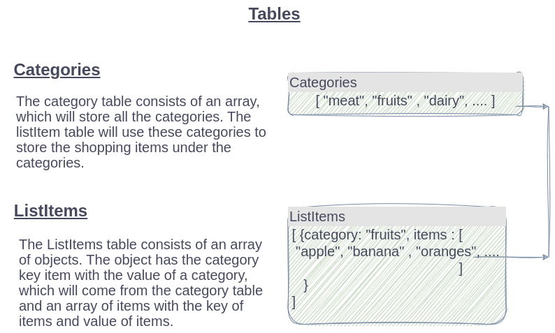
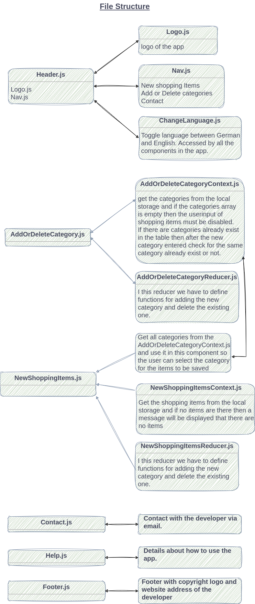

 <h1 style="text-align: center;">Shopping items with categories</h1>

## Use this QR code to download Android app

## or use the following link

https://play.google.com/store/apps/details?id=me.sheeraz

# Need for this app

I always faced problems with my shopping list. I wrote items on paper or sometimes in a notepad in my mobile phone. I had downloaded many apps from the google play store but they are not according to my needs. So, as i am doing Web Development
Course, I said to myself why don't I develop an app for myself and use my knowledge
to solve my personal problems. So this is my effort.

## Usage

In this app, the user can enter the shopping items in differenct categories. For example, if user wants to buy fruits (apple, banana etc), he/she has to enter these items under the fruits category. The idea behind this category is that when the user enters the fruits section of the store he/she knows what fruits he/she has to buy.

## Requirenments

1.  When the app loads, the Heaader, Shopping Item and Footer components will be loaded.

2.  Data will be loaded from the local storage and if data does
    not exist, then empty arrays of category and shopping items will be used.

3.  If there are no categories exist and user opens the new
    shopping items component then a message will be displayed that the user first enters a category. Which user can do by selecting AddOrRemoveCategory option from the menu.

4.  In front of every shopping item a delete button will be
    displayed, so the user can delete the item by pressing it.

5.  AddOrDeleteCategory component will get the saved categories
    from the local storage, and share it globaly by using the AddOrDeleteCategoryContext and add or delete the categories by using reducer.

6.  NewShoppingItems component wil also use the categories and it
    will also use the AddOrDeleteCategoryContext to access the
    categories. It will also uses the NewShoppingItemsReducer to
    save or delete the saved shopping items.

7.  For styling i have used Tailwind which reduces not only the
    number of files but give me more control in a simple way.

## Visual representation of data store in local storage and reactjs components

### if you want to give any suggestions, please email me at <khera724@gmail.com>.
